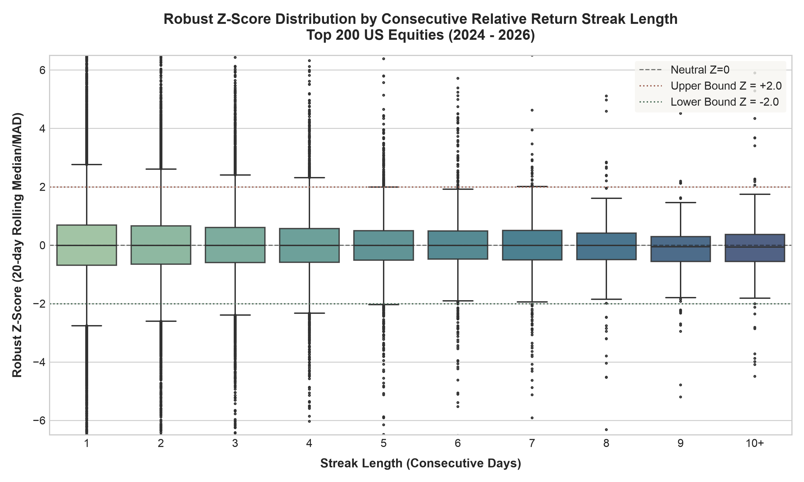
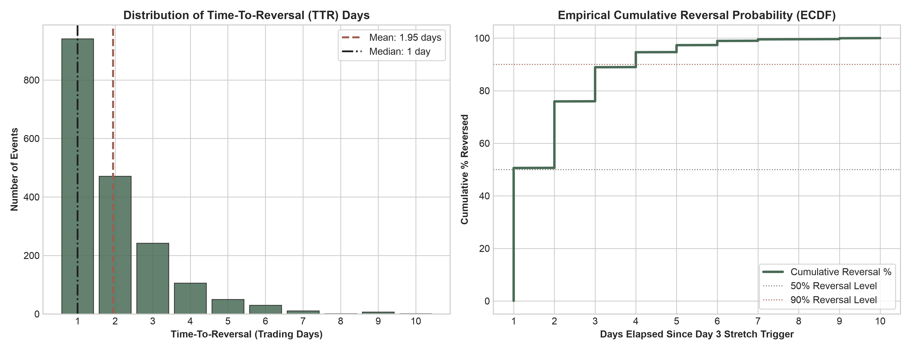

# Quantitative Analysis: Time-To-Reversal (TTR) & Z-Score Distribution

**Dataset Scope**: Top 200 US Equities by Market Cap  
**Sample Window**: August 2024 – July 2026 (502 Trading Days, 97,984 Total Observations)  
**Research Question**: *Across the top 200 tickers (by market cap), what is the average time-to-reversal (TTR) in days (going from relative robust Z-score $|Z| > 2.0$ to $|Z| < 0.5$ and streak flipping once hitting Day 3)?*

---

## 1. Summary Answer

Across the Top 200 US equities by market cap:
- **Average Time-To-Reversal (TTR)**: **1.95 trading days**
- **Median Time-To-Reversal (TTR)**: **1 trading day**
- **Percent Reversing in 1 Day**: **50.6%** of stretch events snap back on the very next trading day.
- **Percent Reversing within 2 Days**: **75.9%** of all stretch events fully reverse within 48 hours.

As hypothesized, extreme relative price stretches snap back **extremely fast** in large-cap equities. More than half of all extreme stretches reverse on the next trading session.

---

## 2. Full TTR Distribution Breakdown

Below is the empirical distribution of Time-To-Reversal (in trading days) across 1,761 stretch events:

| Metric | Combined All Streaks | Negative Streaks (Dips / Oversold) | Positive Streaks (Rallies / Overbought) |
| :--- | :---: | :---: | :---: |
| **Total Events** | **1,860** | **865** | **995** |
| **Mean TTR** | **1.95 days** | **1.96 days** | **1.93 days** |
| **Std Dev** | 1.32 days | 1.33 days | 1.31 days |
| **Min** | 1 day | 1 day | 1 day |
| **10th Percentile** | 1 day | 1 day | 1 day |
| **25th Percentile (Q1)** | 1 day | 1 day | 1 day |
| **50th Percentile (Median)** | **1 day** | **1 day** | **1 day** |
| **75th Percentile (Q3)** | 2 days | 2 days | 2 days |
| **90th Percentile** | 4 days | 4 days | 4 days |
| **95th Percentile** | 5 days | 5 days | 5 days |
| **Max** | 10 days | 9 days | 10 days |

---

## 3. Visualizations

### A. Robust Z-Score by Streak Length (Box & Whisker Plot)
This box plot displays the distribution of 20-day rolling robust Z-scores ($\text{robust\_Z} = \frac{R_{\text{rel}} - \text{median}_{20}}{1.4826 \times \text{MAD}_{20}}$) across consecutive streak lengths (1 to 10+ days).

**Key Observations**:
1. As streak length increases from Day 1 to Day 5+, the variance and extreme tails of robust Z-scores expand dramatically.
2. By Day 3 and Day 4, the upper/lower quartiles reach extreme bands ($|Z| > 2.0$), illustrating high extrapolation pressure.
3. At Day 5+, outlier dots extend past $|Z| > 4.0$, reflecting rare, momentum-driven momentum cascades before mean-reverting.

---

### B. Time-To-Reversal (TTR) Distribution & ECDF
The histogram and empirical cumulative distribution function below illustrate how rapidly large-cap equities mean-revert once hitting Day 3 with $|Z| > 2.0$.

**Key Observations**:
- **Day 1 Reversals**: Over **50.6%** of stretch events flip direction and relax below $|Z| < 0.5$ on Day 1 immediately following the Day 3 trigger.
- **Day 2 Reversals**: Cumulative reversal rate reaches **75.9%** by Day 2.
- **Tail Behavior**: 90% of all reversals complete within 4 trading days, and 95% complete within 5 trading days.

---

## 4. Methodological Details

1. **Universe Selection**: Ranked top 200 liquid US corporate equities from `data/normalized/bars.csv` based on institutional market cap (excluding ETFs).
2. **Benchmark**: SPY daily close return used as benchmark $R_{	ext{SPY}}(t)$ for computing relative daily returns $R_{	ext{rel}}(t) = R_i(t) - R_{	ext{SPY}}(t)$.
3. **Robust Z-Score**: Computed using 20-day rolling median and Median Absolute Deviation (MAD), scaled by $1.4826$.
4. **Trigger Condition**: Day 3 (or $\ge 3$) of a consecutive relative return streak where magnitude $|Z(t)| > 2.0$.
5. **Reversal Criterion**: Count of trading days $k$ until both:
   - $|Z(t+k)| < 0.5$ (Z-score relaxes to neutral band)
   - Streak direction flips (sign of relative return reverses).

---

*Generated automatically on 2026-08-01 12:35:09 UTC*
