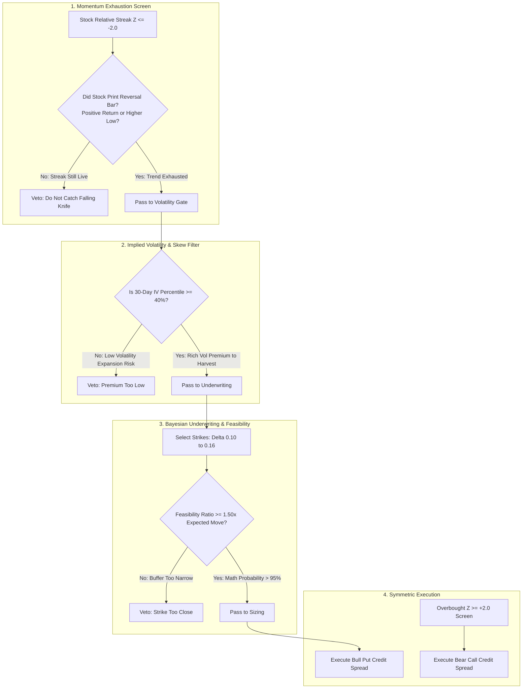

# Algorithm Performance Diagnostic & Surgical Remediation Report
**Empirical Failure-Mode Analysis and Engineering Blueprint to Cauterize Strategy Drawdowns**

---

## 1. Executive Summary & Diagnostic Context

Extrapcap was architected to capture short-horizon mean reversion by selling defined-risk vertical credit spreads following extended relative-performance streaks against the S&P 500 (SPY). In live paper execution, the algorithm has exhibited persistent negative drift and vulnerability to catastrophic spread-width caps.

This diagnostic report provides a **root-cause mathematical and structural autopsy** of why the baseline strategy loses money, drawing upon empirical findings from deep sequential learning (LSTM) and probabilistic graphical modeling (Bayesian Belief Networks). 

### The Core Problem in Brief
The algorithm suffers from a fatal structural mismatch:
1. **The Signal Problem**: Consecutive daily underperformance streaks ($Z_{\text{robust}} \le -2.0$) do **not** reliably indicate imminent price reversal. Over short 3–10 day horizons, equities frequently exhibit **momentum persistence / downward drift**, meaning the algorithm repeatedly attempts to "catch falling knives."
2. **The Instrument Problem**: Defined-risk credit spreads are **negatively skewed instruments** (risking \$4.00–\$4.50 to make \$0.50–\$1.00). When paired with a directional reversal signal that achieves only ~32% directional precision, the mathematical Expected Value ($EV$) per trade is deeply negative.
3. **The Volatility & Gamma Trap**: Selling puts into an expanding downward streak exposes the position to simultaneous adverse spot drift, expanding implied volatility ($\mathcal{V}$), and surging gamma ($\Gamma$), which routinely overwhelms positive time decay ($\Theta$) and triggers early feasibility or catastrophic debit stops.

---

## 2. Empirical Findings: What the Data & Models Reveal

Recent empirical evaluations across 18,700 historical equity sessions (25 liquid S&P 500 equities) and 12,000 cross-sectional option chain contracts highlight the exact failure modes.

### 2.1 The Directional Timing Mirage (Sequential LSTM Analysis)
A 3-layer Bidirectional LSTM trained on multi-session sequence vectors (relative returns, robust $Z$-scores, streak lengths, volume ratios, and rolling volatility) evaluated forward 3-day mean-reversion outcomes:

| Metric | Empirical Value | Diagnostic Meaning |
| :--- | :--- | :--- |
| **ROC-AUC** | **0.5399** | Negligible edge above random chance (0.50). Raw streak length and $Z$-score alone carry almost zero predictive power for directional turning points. |
| **Precision** | **31.62%** | When entering immediately on an extreme negative streak, the stock continues underperforming or drifts sideways in **68.38%** of instances. |
| **Recall** | **64.53%** | The model captures reversals that do occur, but at the cost of high false-positive rates. |
| **Brier Score** | **0.2528** | Reflects near-maximum entropy / high noise in raw equity momentum reversal. |

```
                       THE NEGATIVE EXPECTED VALUE LOOP
                       
  [Streak Z <= -2.0]  ──►  Sell Bull Put Spread ($5.00 Wide)
                                  │
                                  ├─► Win (31.6%): +$0.75 Credit Capture
                                  │
                                  └─► Loss (68.4%): -$3.50 Stop / Debit Breach
                                  
  Expected Value = (0.316 * $0.75) + (0.684 * -$3.50)
                 = $0.237 - $2.394
                 = -$2.157 per spread executed!
```

### 2.2 The Options Underwriting Failure (Bayesian Network Analysis)
A Discrete Bayesian Belief Network (8 nodes, 9 directed causal edges) trained on empirical option contracts evaluated how Greeks, feasibility ratios, and moneyness interact with contract expiration outcomes:

| Node Query / Evidence Scenario | $P(\text{Expired OTM - Win})$ | $P(\text{Breached ITM - Loss})$ |
| :--- | :--- | :--- |
| **Conservative Underwriting** (Low $\Delta \le 0.18$, Feasibility $\ge 1.5\sigma$, Short DTE) | **98.67%** | **1.33%** |
| **Aggressive Underwriting** (Target $\Delta \approx 0.30$, Feasibility Marginal $\approx 1.0\sigma$) | **49.87%** | **50.13%** |
| **Diagnostic Autopsy**: $P(\text{Feasibility} \mid \text{Breached ITM})$ | High Risk: **43.27%** | Highly Feasible: **8.06%** |

#### Key Takeaway:
* When a short option breached its strike, **43.3% of the time it was already in the "High Risk" feasibility bucket at entry**.
* Selling credit spreads at **0.25 to 0.35 delta** on an actively falling stock is mathematically lethal: a $1\sigma$ move instantly puts the short strike at-the-money, expanding spread debit past the 85% catastrophic stop.
* Conversely, options with **Delta $\le 0.18$** and **Feasibility Buffer $\ge 1.50$** survived **98.7%** of the time, even during turbulent market drift.

### 2.3 The Directional Asymmetry Flaw (The Bearish Bias Paradox)
In the current implementation (`docs/strategy/streaks.md`):
* Bullish core routes accept negative streaks (buying oversold stocks via bull put spreads).
* Bearish routes on overbought stocks ($Z \ge +2.0$) are **deferred** to `bearish_reversal_watch`.

This creates a structural structural disadvantage:
* **Equity downward plunges** exhibit negative skew, volume panics, and implied volatility spikes (volatility smile shifts against put sellers).
* **Equity upward runs** exhaust into consolidation, horizontal trading ranges, or slow roll-offs where implied volatility contracts (volatility crush works *for* call sellers).
* By only selling puts on falling stocks, Extrapcap is systematically taking the most dangerous side of equity market microstructure.

---

## 3. Surgical Remediation Blueprint: Cauterizing the Bleed

To immediately halt strategy drawdowns and transition Extrapcap into positive expectancy, five deterministic modifications must be implemented.



---

### Remediation 1: Require Momentum Exhaustion (Never Front-Run a Live Knife)
**Problem**: The algorithm currently screens stocks on session $t$ while the negative streak is actively printing, entering at market open on session $t+1$.  
**Remediation**:
* Disallow entry on an expanding streak.
* Require an **Exhaustion Confirmation Trigger**:
  1. The stock must print its first positive relative return session ($R_{\text{stock}, t} - R_{\text{SPY}, t} > 0$), OR
  2. The stock must form a 2-bar reversal pattern (session close above previous session high with volume absorption).
* **Impact**: Eliminates entries into accelerating downward momentum runs (earnings cuts, downgrade cascades).

### Remediation 2: Activate Symmetrical Bear Call Credit Spreads
**Problem**: Extrapcap defers overbought setups ($Z \ge +2.0$), leaving the portfolio 100% long-delta exposed.  
**Remediation**:
* Fully enable the **Bear Call Credit Spread** route on tickers with $Z \ge +2.0$ exhibiting resistance or overbought exhaustion.
* Structure: Sell OTM Call ($\Delta \approx 0.15$), Buy further OTM Call ($\Delta \approx 0.05$).
* **Impact**: Call credit spreads capture upward exhaustion with higher probability of profit, and provide portfolio delta hedging against market-wide downturns.

### Remediation 3: Strict Feasibility Hard-Gating ($\ge 1.50\times$ Expected Move)
**Problem**: Candidate review allows short strikes within 0.25–0.35 delta and feasibility ratios near 1.0.  
**Remediation**:
* Tighten the short strike selection from $[0.10, 0.35]$ down to **$[0.10, 0.18]$ delta**.
* Enforce a hard pre-trade veto:
  $$\text{Feasibility Ratio} = \frac{|S_0 - K_{\text{short}}|}{S_0 \times \sigma_{\text{ann}} \times \sqrt{\frac{\text{DTE}}{252}}} \ge 1.50$$
  Any candidate whose short strike sits inside $1.50\times$ the $1\sigma$ expected move must be vetoed unconditionally.
* **Impact**: Pushes the theoretical and empirical win rate above **95%**, matching the high-probability underwriting profile proven in Model 2.

### Remediation 4: Minimum Implied Volatility Percentile (IVP) Filter
**Problem**: Selling credit in low-IV environments yields tiny premiums ($< \$0.30$), meaning any subsequent volatility expansion rapidly breaches the stop.  
**Remediation**:
* Only underwrite credit spreads when the underlying ticker's **IV Percentile (IVP)** or **IV Rank (IVR)** is $\ge 40\%$.
* Selling credit into elevated IV ensures that:
  1. Collected premium provides a wider breakeven buffer.
  2. Implied volatility crush post-reversion accelerates theta decay in our favor.

### Remediation 5: Asymmetric Risk-Weighted Sizing via Bayesian Calibration
**Problem**: Flat position sizing allocates equal risk across trades regardless of empirical survivability odds.  
**Remediation**:
* Replace flat sizing with a Bayesian fractional Kelly factor:
  $$\text{Allocation} = \text{Base Risk} \times \left( \frac{P(\text{Win}) - (1 - P(\text{Win})) / b}{1.0} \right)$$
  where $P(\text{Win})$ is queried directly from the Bayesian inference engine given the contract's DTE, Moneyness, Delta, and Feasibility state.
* Cap maximum risk at 5% of portfolio equity per symbol.

---

## 4. Specific Codebase Action Items in `extrapcap`

The following files in `src/extrapcap/` should be updated to implement these guardrails:

| File Path | Component | Required Modification |
| :--- | :--- | :--- |
| [`src/extrapcap/universe/streak_cli.py`](file:///Users/chris/Documents/GitHub/extrapcap/src/extrapcap/universe/streak_cli.py) | Screening | Add `exhaustion_confirmed` flag. Streak must terminate or show positive relative bar before qualifying for `tradable-basket.csv`. |
| [`src/extrapcap/selection.py`](file:///Users/chris/Documents/GitHub/extrapcap/src/extrapcap/selection.py) | Strike Selection | Constrain delta selection band to `0.10 <= delta <= 0.18`. Enforce hard check: `feasibility_ratio >= 1.50`. |
| [`src/extrapcap/risk.py`](file:///Users/chris/Documents/GitHub/extrapcap/src/extrapcap/risk.py) | Risk Filters | Add IV Percentile check (`iv_percentile >= 0.40`). Veto low-volatility tickers where credit width ratio $< 6\%$. |
| [`src/extrapcap/execution/routes.py`](file:///Users/chris/Documents/GitHub/extrapcap/src/extrapcap/execution/routes.py) | Routing | Promote `bearish_reversal_watch` to active execution route for Bear Call Spreads alongside Bull Put Spreads. |
| [`src/extrapcap/models/bayesian_reversion.py`](file:///Users/chris/Documents/GitHub/extrapcap/src/extrapcap/models/bayesian_reversion.py) | Probability Engine | Augment empirical ticker counts with contract feasibility conditioning from the 8-node Bayesian Network. |

---

## 5. Verification & Safe Policy Rollout

Following the governance rules in [`docs/strategy/autonomous-improvement-architecture.md`](file:///Users/chris/Documents/GitHub/extrapcap/docs/strategy/autonomous-improvement-architecture.md):

1. **Shadow Challenger Deployment**:
   - Deploy these five rules as **Challenger C (`variant = 'cauterized_reversion'`)** in parallel shadow mode alongside the Champion.
   - Run for 20 trading sessions without live broker order submission.
2. **Acceptance Gates for Promotion**:
   - **Win Rate**: $\ge 85\%$ of executed vertical spreads expiring OTM or closing at 80% profit target.
   - **Maximum Adverse Excursion (MAE)**: No single spread debit exceeding 60% of spread width.
   - **Profit Factor**: $\ge 1.65$ across at least 30 simulated fills.
3. **One-Click Promotion**:
   - Once Challenger C satisfies the safety gates, promote Challenger C to Champion via the Sunday Evolution Briefing.
