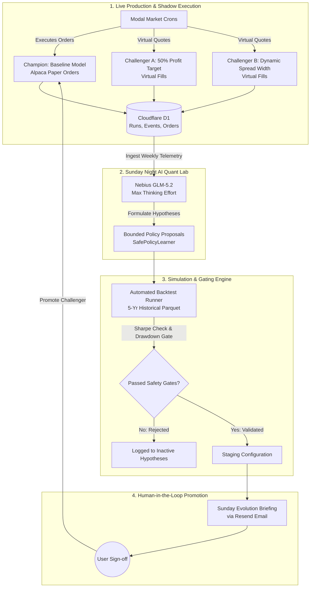
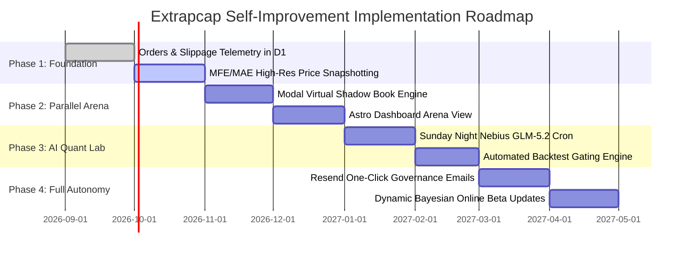

# Extrapcap: Autonomous Self-Improving Strategy Architecture
**A Continuous Learning Blueprint for Quantitative Credit Spread Trading**

---

## 1. Executive Summary & Architectural Vision

To evolve Extrapcap from a static rules-based system into a **living, self-improving quantitative algorithm**, we establish a closed-loop learning architecture.

Traditional algorithmic trading systems suffer from parameter decay: static heuristics that work in one market regime (e.g., low-volatility bull markets) degrade when volatility regimes shift. Conversely, naive machine learning systems that directly modify execution rules risk overfitting and catastrophic tail risk.

Extrapcap's continuous improvement architecture balances **dynamic LLM-driven adaptation** with **deterministic mathematical guardrails**:
1. **LLMs Propose**: Nebius GLM-5.2 analyzes trading friction, execution slippage, MFE/MAE excursions, and market regimes to formulate hypotheses.
2. **Backtests Verify**: Hypotheses are simulated against historical market bars; non-performing ideas are filtered automatically.
3. **Challengers Compete**: Parameter variants run in parallel live shadow books (Champion vs. Challengers) to collect real out-of-sample execution telemetry.
4. **Humans Approve**: Safe policy boundaries prevent unauthorized parameter changes; promotion requires one-click user sign-off.



---

## 2. Core Mechanism 1: The "Champion / Challenger" Parallel Execution Engine

Rather than updating parameters directly in live trading, Extrapcap deploys a **Multi-Model Arena** running concurrently during market hours.

### 2.1 The Portfolio Roster
1. **The Champion (Production Baseline)**:
   - Rules: 80% Max Profit Target, static $5.00 spread width, 1.25 feasibility cutoff, -2.0 Z-score threshold.
   - Execution: Routes real orders to Alpaca Paper Trading API.
   - Tag: `strategy_variant = 'champion'` in Cloudflare D1.
2. **Challenger A (High-Velocity / 50% Take-Profit)**:
   - Rules: 50% Max Profit Target, tighter Z-score entry (-1.75), recycling capital immediately.
   - Execution: Virtual shadow book. Uses real-time Alpaca NBBO market quotes to simulate fills without consuming account margin.
   - Tag: `strategy_variant = 'challenger_velocity'` in Cloudflare D1.
3. **Challenger B (Regime-Adaptive / Dynamic Widths)**:
   - Rules: Scaled spread width ($10 on stocks > $300, $5 on stocks < $300), persistence-gated feasibility stops (2 consecutive intervals).
   - Execution: Virtual shadow book against live feeds.
   - Tag: `strategy_variant = 'challenger_adaptive'` in Cloudflare D1.

### 2.2 Cloudflare D1 Schema Integration
Our existing [`schema.sql`](file:///Users/chris/Documents/GitHub/extrapcap/schema.sql) already supports this multi-variant design through the `runs` table:
```sql
CREATE TABLE IF NOT EXISTS runs (
  run_id TEXT PRIMARY KEY,
  as_of_date TEXT NOT NULL,
  phase TEXT NOT NULL,
  strategy_variant TEXT NOT NULL DEFAULT 'baseline',
  status TEXT NOT NULL,
  detail TEXT
);
```
During the 09:35 AM screener and 30-minute position management crons in Modal, the engine initializes execution contexts for each active variant, recording trades, mark-to-market snapshots, and exit signals under the corresponding `strategy_variant` key.

### 2.3 The "Strategy Arena" Dashboard
We surface this live competition in the Astro UI at `/scoreboard/arena`:
- **Leaderboard Cards**: Comparing Sharpe, Net PnL, Win Rate, Average Days Held, and Annualized ROC.
- **Head-to-Head Trade Table**: Displaying where Challenger exited early compared to Champion (e.g., showing how Challenger A banked ADBE profit on Day 2 while Champion held through Day 22).

---

## 3. Core Mechanism 2: The Sunday Night "AI Quant Lab" (Nebius GLM-5.2)

Every Sunday evening at 20:00 ET, Modal triggers a scheduled recurring job: `weekly_improvement_cron`.

### 3.1 Telemetry Aggregation
The cron extracts the trailing 30-day operational ledger from Cloudflare D1:
- **Order Slippage**: Difference between quoted midpoint and fill price across all orders.
- **MFE / MAE Trajectories**: Maximum favorable and adverse excursion profiles for all active and closed positions.
- **Risk Vetoes & Opportunity Costs**: Screener candidates that had reversion probability $\ge 0.65$ but were rejected by portfolio or sector concentration caps.
- **Market Context**: SPY 20-day realized volatility, VIX trend, and sector dispersion.

### 3.2 High-Reasoning LLM Diagnosis
The data payload is fed to [`NebiusPolicyLearner`](file:///Users/chris/Documents/GitHub/extrapcap/src/extrapcap/improvement.py), calling Nebius GLM-5.2 with `thinking_effort="max"`.

#### Prompt Design & Role
```text
You are the Chief Quantitative Risk Officer and Policy Learner for Extrapcap.
Review the trailing week's execution ledger, trade excursion data (MFE/MAE),
and risk veto history.

Diagnose:
1. Capital Inefficiency: Did winning trades tie up collateral past their inflection point?
2. Adverse Selection: Are limit orders experiencing adverse fill slippage?
3. Filter Bottlenecks: Did risk caps eliminate candidates that subsequently outperformed?
4. Stop Whipsaws: Did feasibility stops trigger immediately prior to price recovery?

Formulate bounded parameter adjustments using the SafePolicyLearner bounds:
- z_threshold: [-3.0, -1.0], step 0.25
- max_option_spread_pct: [0.15, 0.50], step 0.05
- min_credit_pct_width: [0.02, 0.30], step 0.03
- profit_target_pct: [0.40, 0.80], step 0.05
- feasibility_ratio_cutoff: [1.00, 1.50], step 0.05
```

### 3.3 Bounded Safety Enforcement
The LLM cannot directly output raw code or execute shell commands. It must return structured JSON conforming to [`SafePolicyLearner`](file:///Users/chris/Documents/GitHub/extrapcap/src/extrapcap/improvement.py):
```python
@dataclass(frozen=True)
class PolicyProposal:
    parameter: str
    current: float
    proposed: float
    evidence: dict
    status: str = "proposed"
```
Parameter changes are strictly constrained by predefined low/high bounds and discrete step sizes, preventing wild swings or hallucinations.

---

## 4. Core Mechanism 3: Automated Counterfactual Backtesting & Safety Gates

Before any proposal is shown to the user, the Sunday Night cron spins up an automated backtesting container using [`compare_variants`](file:///Users/chris/Documents/GitHub/extrapcap/src/extrapcap/backtest/compare.py).

### 4.1 The Backtest Gatekeeper
The backtest tests the proposed parameter against 5 years of historical market bars (SPY, QQQ, and greenlisted constituents):
```python
simulation = run_backtest(bars, benchmark, variant=proposed_variant, cfg=proposed_cfg)
```

### 4.2 Hard Safety Pass/Fail Criteria
A proposal is automatically marked `REJECTED` if it violates any of the following deterministic rules:
1. **Unit Test Suite**: Full `pytest` execution must pass 100% without regression.
2. **Maximum Drawdown**: Simulated historical max drawdown cannot exceed the baseline by more than 1.5%.
3. **Win Rate Floor**: Simulated win rate must remain $\ge 65\%$.
4. **Sharpe Ratio Improvement**: Annualized Sharpe ratio over out-of-sample data must improve by at least $+0.15$.

Only proposals passing all 4 gates are promoted to `status: validated`.

---

## 5. Core Mechanism 4: Human-in-the-Loop Governance & One-Click Promotion

We maintain strict human-in-the-loop governance: **no configuration changes touch live capital without explicit user approval.**

### 5.1 Sunday Night Evolution Briefing (Resend Email)
When a proposal passes all automated gates, the system formats a briefing email sent via Resend:

> **Extrapcap Weekly Policy Evolution Report**
>
> **Proposed Adjustment**: `profit_target_pct`: `0.80` $\to$ `0.50`
> **Primary Rationale (Nebius GLM-5.2)**:
> *"ADBE and MSFT positions reached +18% and +24% ROC within 72 hours, but took an additional 18 days to reach the 80% threshold. Closing at 50% increases annualized portfolio turnover by 1.8x and reduces tail gap exposure."*
>
> **Simulation Results (5-Year Historical)**:
> - Sharpe Ratio: Baseline `1.42` $\to$ Proposed `1.68` (+0.26)
> - Max Drawdown: Baseline `-8.4%` $\to$ Proposed `-7.1%` (-1.3%)
> - Capital Turnover: Baseline `4.2 days avg` $\to$ Proposed `2.3 days avg`
>
> [👉 **Deploy to Challenger A**] &nbsp;|&nbsp; [🚀 **Promote to Champion**] &nbsp;|&nbsp; [❌ **Decline Proposal**]

### 5.2 Safe Rollback Guarantee
All approved parameter sets are versioned as immutable JSON snapshots in `config/policies/YYYY-MM-DD-vX.json`. A single click or CLI command (`extrapcap rollback`) restores the prior baseline instantly.

---

## 6. Core Mechanism 5: Dynamic Bayesian Online Learning

In addition to discrete parameter tuning, the underlying statistical engine ([`bayesian_reversion.py`](file:///Users/chris/Documents/GitHub/extrapcap/src/extrapcap/models/bayesian_reversion.py)) should continuously adapt:

### 6.1 Online Beta Prior Updates
The probability of a ticker mean-reverting after an $N$-day relative drop is modeled via a Beta distribution:
$$\theta \sim \text{Beta}(\alpha, \beta)$$
At the end of every trading week:
1. Extract all observed streak outcomes across the entire 500-stock universe.
2. Update the posterior distribution parameters:
   $$\alpha_{t+1} = \alpha_t + \text{reversions\_observed}$$
   $$\beta_{t+1} = \beta_t + \text{continuations\_observed}$$
3. Apply an exponential decay factor ($\lambda = 0.98$) so the model weights recent market regimes more heavily than ancient data.

This ensures the Bayesian streak filter remains sharply calibrated whether the market is in an ultra-low volatility grind or a high-volatility correction.

---

## 7. Implementation Roadmap



### Next Actionable Engineering Steps
1. **D1 Schema Update**: Add `quoted_mid_at_route`, `slippage_vs_mid`, and `variant` indexing to `schema.sql`.
2. **Shadow Book Runner**: Implement `run_virtual_order()` in `src/extrapcap/execution.py` to allow simulated fills against live NBBO.
3. **Weekly Cron**: Create `modal_app/functions/weekly_improvement.py` wrapping `NebiusPolicyLearner` and `compare_variants`.
